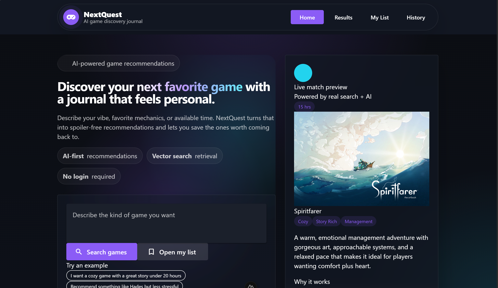
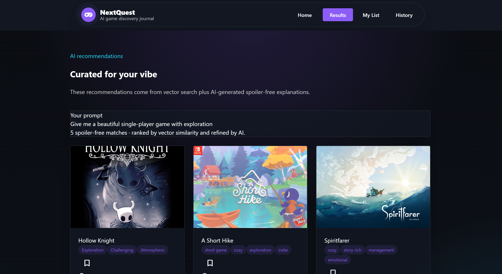
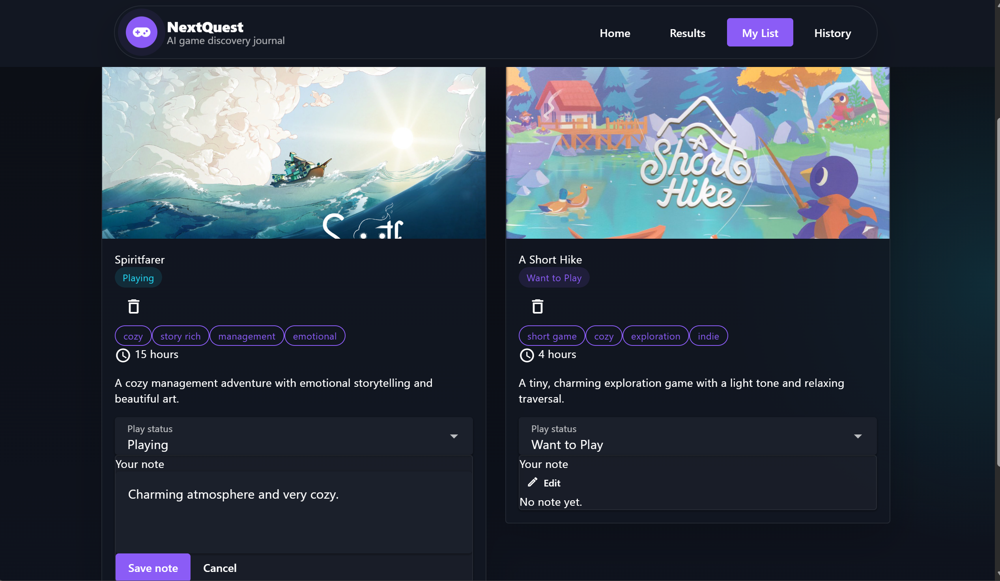
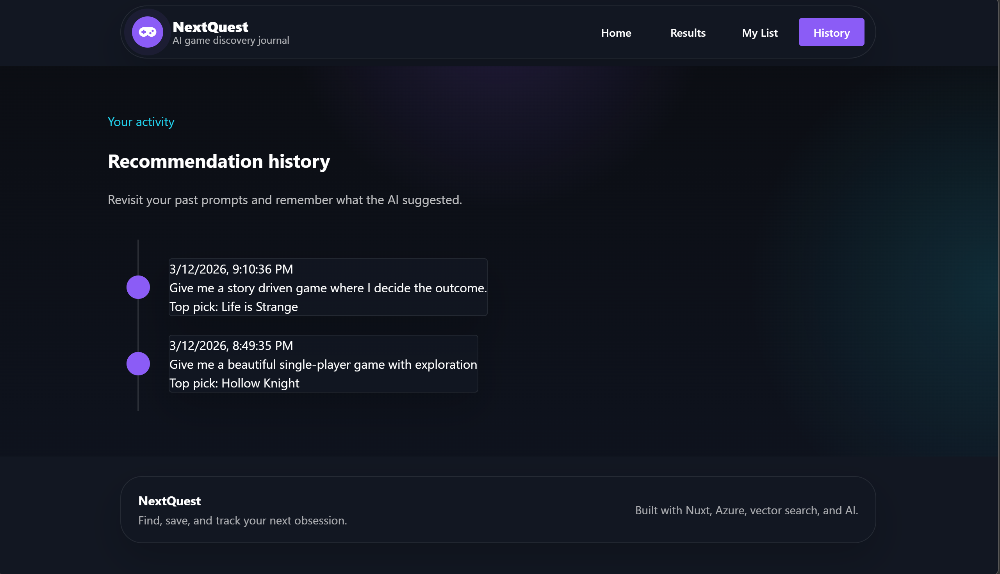

# [NextQuest](https://icy-plant-0a2895310.6.azurestaticapps.net/) — AI Game Discovery Journal

## Elevator Pitch

NextQuest is an AI-powered game discovery journal that helps players find their next favorite game based on mood, preferences, and time availability. Instead of endless scrolling through storefronts or reviews, users describe their vibe and receive personalized recommendations powered by vector search and AI. NextQuest turns discovery into a reflective, organized experience by allowing users to save games, track play status, and write personal notes.

## Target Audience

#### NextQuest is designed for:

- Casual gamers overwhelmed by large game libraries
- Story-driven players seeking meaningful recommendations
- Indie game enthusiasts
- Students and busy professionals with limited playtime
- Players who enjoy journaling or tracking gaming experiences

## Use Cases

- A player wants a cozy story game under 20 hours
- Someone wants recommendations similar to a favorite game
- A user wants to track games they plan to play
- A player wants to record thoughts after finishing a game
- A user wants to revisit past recommendation sessions

## Core Features

- AI-powered natural language game search
- Vector similarity search using Azure AI Search
- Save games to a personal list
- Track play status (Want to Play / Playing / Finished / Dropped)
- Add personal journal notes to saved games
- Recommendation history tracking
- Fully responsive UI (mobile + desktop)
- Production deployment on Azure

## Tech Stack

#### Frontend:

- Nuxt 4
- Vue 3
- Vuetify
- TypeScript

#### Backend:

- NestJS
- Prisma ORM
- Azure SQL Database

#### AI + Search:

- Azure AI Search (vector search)
- OpenAI (embeddings + recommendation reasoning)

#### Infrastructure:

- Azure App Service (backend)
- Azure Static Web Apps (frontend)
- GitHub Actions CI/CD

## Technical Architecture

#### NextQuest uses an AI-first recommendation pipeline:

- User submits a natural language prompt
- Prompt is converted into an embedding vector
- Azure AI Search retrieves similar games using vector similarity
- OpenAI generates human-readable recommendation reasoning
- Results are stored in Azure SQL
- User can save games and add journal notes

#### This architecture demonstrates:

- Retrieval-Augmented Generation (RAG)
- Vector database search
- Full-stack cloud deployment
- AI-integrated product design

## Screenshots
### Home

### AI Recommendations

### My List (Game Journal)

### Recommendation History

### Mobile Experience

## What I Learned

- Designing AI-first user experiences
- Implementing vector search systems
- Full-stack cloud deployment with Azure
- CI/CD automation with GitHub Actions
- Production UI/UX design principles
- Managing async AI pipelines
- Building scalable recommendation architectures

## Why This Project Matters

Game discovery is often fragmented and overwhelming. NextQuest demonstrates how AI can transform discovery into a personalized, reflective experience. The project explores how recommendation systems can move beyond utility and become tools for memory, reflection, and enjoyment.
